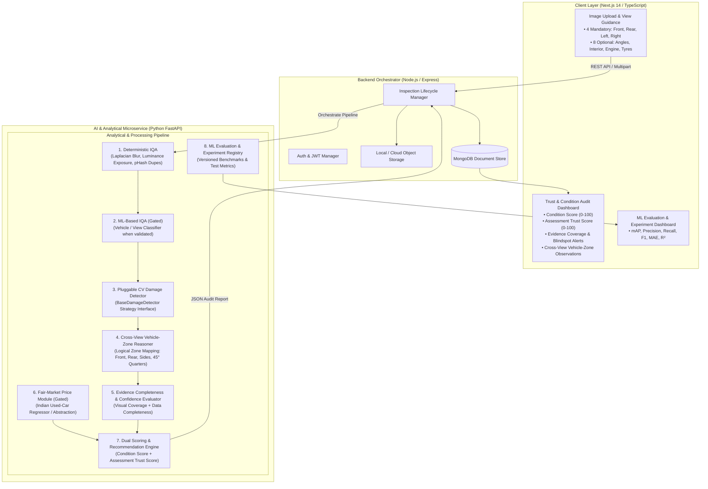

# AutoTrust AI — Refined System Architecture & Specification Document

## Executive Summary
AutoTrust AI is an AI-assisted used-car evaluation and trust platform designed to provide transparent, verifiable, and explainable condition and risk assessments for prospective car buyers.

This document details the refined technical architecture, establishing strict separation between statistical machine learning models, deterministic validation rules, scoring formulations, and domain heuristics.

---

## 1. System Taxonomy & Boundary Definitions

To ensure scientific credibility and prevent misleading representations, all algorithms and data processors in AutoTrust AI are categorized into one of four analytical layers:

| Layer | Type | Responsibility | Examples in AutoTrust AI |
| :--- | :--- | :--- | :--- |
| **Layer 1** | **AI / ML Models** *(Statistical Inference)* | Probabilistic pattern recognition and regression on unstructured data. | • Object Detection for body damages (Dents, Scratches, Cracks, Rust)<br>• Damage Severity Head (Minor, Moderate, Severe)<br>• ML View/Vehicle Classifier (When validated)<br>• Fair-Market Valuation Regressor (When validated on Indian used-car dataset) |
| **Layer 2** | **Deterministic Rule Engines** *(Hard Logic)* | Binary constraints, sanity gates, and regulatory validations. | • 4-Mandatory View Presence Checker<br>• Image dimension / payload size validation<br>• Deterministic IQA: Laplacian blur, luminance exposure, pHash duplicate detection<br>• Odometer rollback anomaly check<br>• Logical Vehicle-Zone Mapper & Recommendation Rules |
| **Layer 3** | **Scoring Formulas** *(Mathematical Aggregators)* | Deterministic, weighted mathematical models yielding bounded ratings ($0–100$). | • **Vehicle Condition Score** ($S_{condition} \in [0, 100]$)<br>• **Visual Coverage Index** ($C_{visual} \in [0, 1]$)<br>• **Evidence Confidence Index** ($C_{evidence} \in [0, 1]$)<br>• **Buyer Assessment Trust Score** ($S_{trust} \in [0, 100]$) |
| **Layer 4** | **Domain Heuristics** *(Empirical Baselines)* | Expert automotive repair cost baselines and depreciation tables. | • Standard repair cost estimation lookup tables<br>• Panel criticality weights (e.g. Hood/A-Pillar vs. Rear Bumper)<br>• Base depreciation curves |

> ⚠️ **Design Principle:** Heuristics, rule engines, and scoring formulas must never be labeled or described as "AI". AI is strictly reserved for trained machine learning models.

---

## 2. End-to-End System Architecture



---

## 3. Image Requirements & IQA Subsystem (Deterministic vs. ML Separation)

### 3.1 Image Hierarchy
- **Mandatory (4 Views):** `FRONT`, `REAR`, `LEFT_SIDE`, `RIGHT_SIDE`.
  - Missing any mandatory angle sets inspection status to `PARTIAL_EVIDENCE`, applies an immediate penalty to the Assessment Trust Score, and surfaces explicit buyer warnings.
- **Optional (8 Views):** `FRONT_LEFT_45`, `FRONT_RIGHT_45`, `REAR_LEFT_45`, `REAR_RIGHT_45`, `INTERIOR_CABIN`, `DASHBOARD_ODOMETER`, `ENGINE_BAY` *(experimental)*, `TYRES` *(experimental)*.

### 3.2 Deterministic Quality Checks vs. ML Checks

```
                      Uploaded Image
                            │
                            ▼
        ┌───────────────────────────────────────┐
        │  1. Deterministic Duplicate Check     │ ──[Duplicate (pHash dist ≤ 4)]──► Reject / Ignore
        └───────────────────┬───────────────────┘
                            │ Pass
                            ▼
        ┌───────────────────────────────────────┐
        │     2. Deterministic Blur Check       │ ──[Laplacian Var < 100]────────► Reject / Re-upload
        └───────────────────┬───────────────────┘
                            │ Pass
                            ▼
        ┌───────────────────────────────────────┐
        │  3. Deterministic Exposure Check      │ ──[Mean V < 40 or Glare > 15%]─► Warn User
        └───────────────────┬───────────────────┘
                            │ Pass
                            ▼
        ┌───────────────────────────────────────┐
        │  4. ML View/Vehicle Check (Gated)     │ ──[Classifier when validated]──► Check View Angle
        └───────────────────┬───────────────────┘
                            │ Pass
                            ▼
               Send to CV Damage Detector
```

---

## 4. Pluggable CV Architecture (`BaseDamageDetector`)

The CV damage detection pipeline is decoupled using the **Strategy Pattern**. The system defines a generic interface `BaseDamageDetector`, allowing the model backend to be swapped (Mock $\to$ YOLOv8/9/10/11 $\to$ TorchVision $\to$ Cloud API) with zero modifications to downstream reasoning or scoring engines.

### Abstract Adapter Interface
```python
from abc import ABC, abstractmethod
from typing import List
from pydantic import BaseModel

class BoundingBox(BaseModel):
    x_min: float
    y_min: float
    x_max: float
    y_max: float
    area_ratio: float

class DamageDetection(BaseModel):
    damage_type: str  # dent, scratch, crack, rust, paint_peel, misalignment
    severity: str     # minor, moderate, severe
    confidence: float # 0.0 - 1.0
    bbox: BoundingBox
    panel_location: str # front_bumper, hood, left_front_door, etc.

class BaseDamageDetector(ABC):
    @abstractmethod
    def load_model(self, weights_path: str) -> None:
        """Initialize model weights and runtime device."""
        pass

    @abstractmethod
    def predict(self, image_bytes: bytes, view_name: str) -> List[DamageDetection]:
        """Execute damage detection on a single vehicle image."""
        pass
```

---

## 5. Cross-View Vehicle-Zone Reasoning (No 3D Reconstruction Claims)

The system maps detections from different 2D camera angles into **8 Logical Vehicle Zones**:
1. `ZONE_FRONT` (Front bumper, grille, hood)
2. `ZONE_REAR` (Rear bumper, boot lid, taillights)
3. `ZONE_FRONT_LEFT` (Left front fender, left headlight, left wheel arch)
4. `ZONE_FRONT_RIGHT` (Right front fender, right headlight, right wheel arch)
5. `ZONE_REAR_LEFT` (Left rear quarter panel, left taillight, left rear wheel arch)
6. `ZONE_REAR_RIGHT` (Right rear quarter panel, right taillight, right rear wheel arch)
7. `ZONE_LEFT_SIDE` (Left doors, side skirts, A/B/C pillars)
8. `ZONE_RIGHT_SIDE` (Right doors, side skirts, A/B/C pillars)

### Synthesizer Output Phrasing
- ❌ **Prohibited:** "The vehicle was in an accident." / "3D mesh reveals chassis misalignment."
- ✅ **Mandatory Phrasing:** 
  - *"Co-located cosmetic flaws observed across adjacent panels in ZONE_FRONT_RIGHT."*
  - *"Possible previous repair or impact-related cosmetic pattern."*
  - *"Requires physical verification and paint depth inspection."*

---

## 6. Price Valuation Policy (Indian Used-Car Market Gating)

- **Zero Fake Data Policy**: No fabricated market prices will ever be generated and presented as AI predictions.
- **Dataset Gating**: The price estimation module operates behind an abstraction interface and requires a verified Indian used-car dataset (e.g. Cardekho, Cars24, Kaggle Indian Used Cars).
- **Fallback Status**: If a validated dataset/model is not loaded, the module explicitly reports `PENDING_DATASET_VALIDATION` with limitations clearly communicated to the buyer.

---

## 7. Scoring Architecture & Academic Traceability

### 7.1 Vehicle Condition Score ($S_{condition}$)
Measures physical cosmetic integrity based strictly on observable visual evidence ($0 \le S_{condition} \le 100$):
$$S_{condition} = \max\left(0, 100 - \sum_{i=1}^{N} D_i \cdot w_{\text{severity}}(s_i) \cdot w_{\text{panel}}(p_i)\right)$$

### 7.2 Evidence Confidence Index ($C_{evidence}$)
Measures evidence completeness from image coverage and data disclosures ($0 \le C_{evidence} \le 1.0$):
$$C_{evidence} = \left( \sum_{v \in V_{\text{mandatory}}} \frac{w_v}{4} \times 0.70 \right) + \left( \sum_{v \in V_{\text{optional}}} \frac{w_v}{|V_{\text{opt}}|} \times 0.20 \right) + \left( \frac{\text{Disclosed Fields}}{\text{Total Fields}} \times 0.10 \right)$$

### 7.3 Buyer Evidence Confidence / Assessment Trust Score ($S_{trust}$)
Represents confidence in the assessment itself, NOT seller honesty ($0 \le S_{trust} \le 100$):
$$S_{trust} = \Big( 0.40 \cdot S_{condition} + 0.30 \cdot (C_{evidence} \times 100) + 0.20 \cdot S_{price\_avail} + 0.10 \cdot (\bar{Q}_{AI} \times 100) \Big) - P_{anomalies}$$

---

## 8. ML Evaluation & Experiment Registry

Every ML module includes measurable metrics tracked against standardized benchmarks:
- **Damage Detection**: Precision, Recall, F1-Score, $\text{mAP@50}$, $\text{mAP@50:95}$.
- **Damage Severity Classification**: Multi-class Confusion Matrix, Precision, Recall, F1.
- **Image Quality Classification**: Accuracy, Precision, Recall, F1.
- **Price Regression**: MAE, RMSE, $R^2$.

---

## 9. 15-Phase Implementation Strategy

Implementation is strictly sequential across 15 phases. After each phase, development halts to deliver a checkpoint report before proceeding.

1. **Phase 1**: Repository & Project Scaffolding
2. **Phase 2**: Frontend Foundation
3. **Phase 3**: Backend API + MongoDB Foundation
4. **Phase 4**: Authentication & Inspection Workflow
5. **Phase 5**: Image Upload & View Validation
6. **Phase 6**: Deterministic Image Quality Assessment (IQA)
7. **Phase 7**: CV Model Integration via `BaseDamageDetector`
8. **Phase 8**: Damage Detection & Severity Classification
9. **Phase 9**: Vehicle-Zone & Cross-View Reasoning
10. **Phase 10**: Vehicle Condition Scoring Engine
11. **Phase 11**: Evidence Confidence & Visual Coverage Module
12. **Phase 12**: Indian Used-Car Price Valuation (Gated)
13. **Phase 13**: Assessment Trust Score & Recommendations
14. **Phase 14**: Final Audit Report & Dashboard
15. **Phase 15**: Testing, ML Evaluation & Experiment Registry
